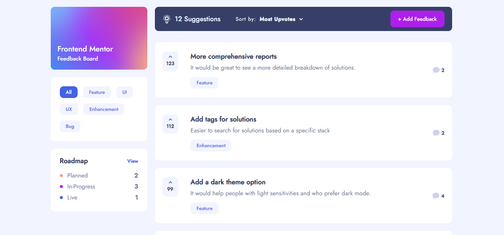
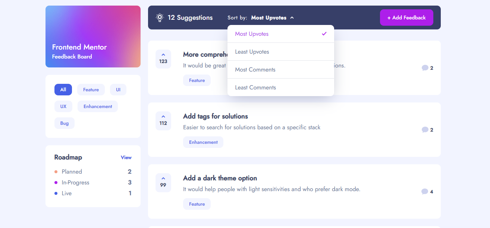
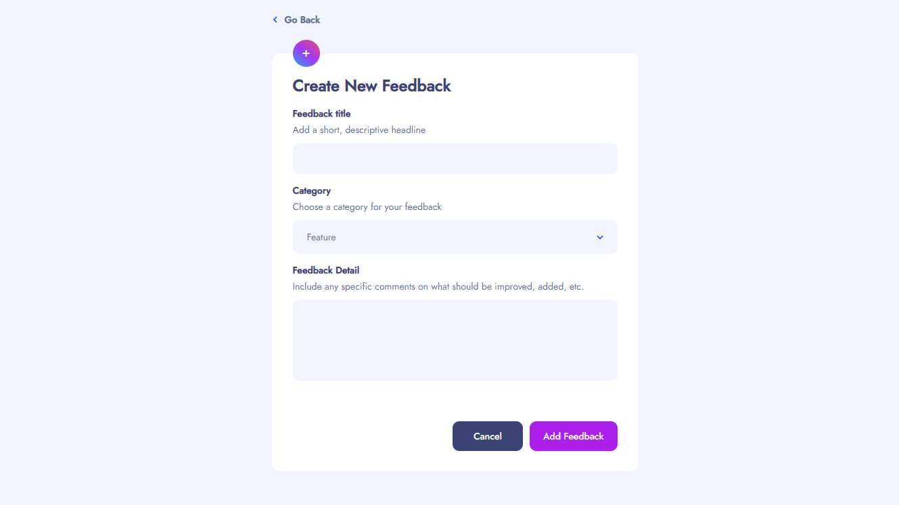
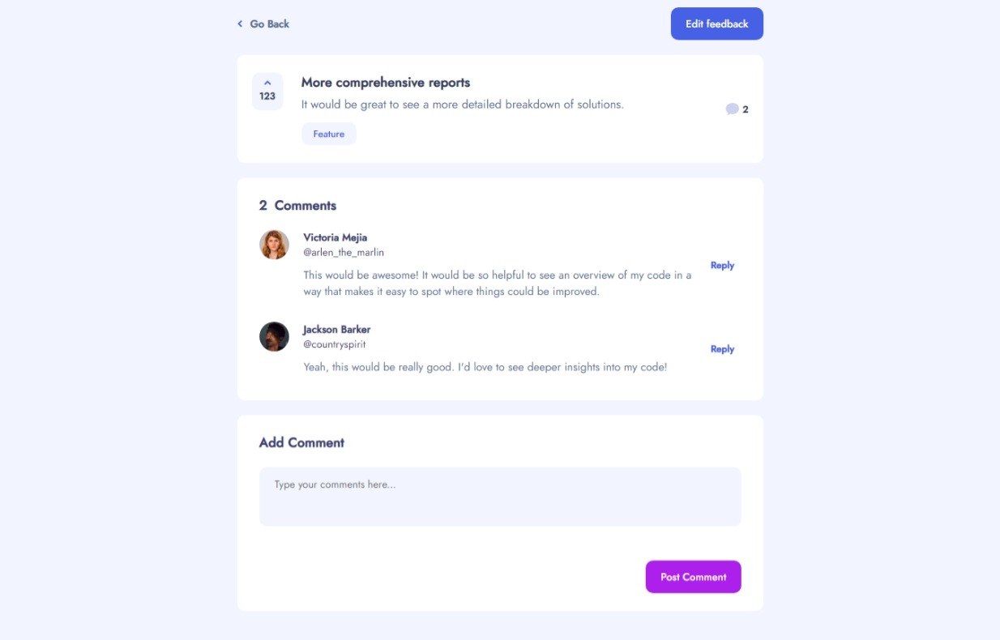
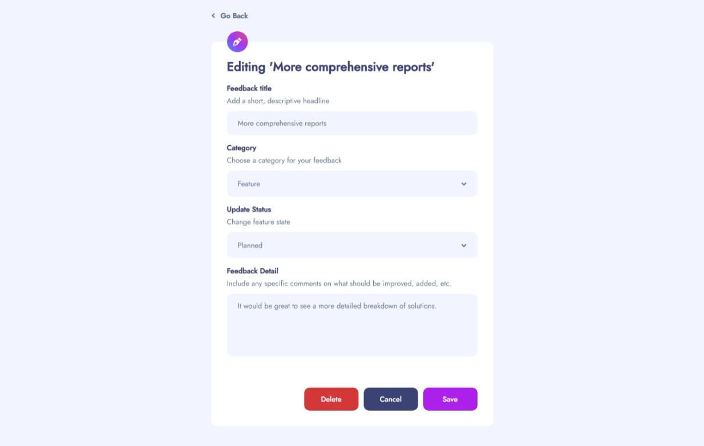
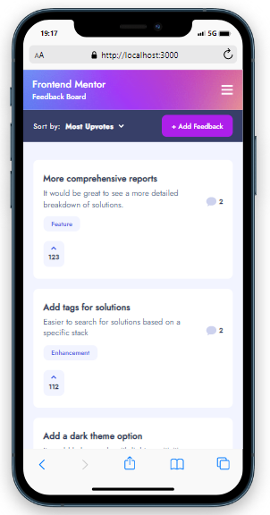
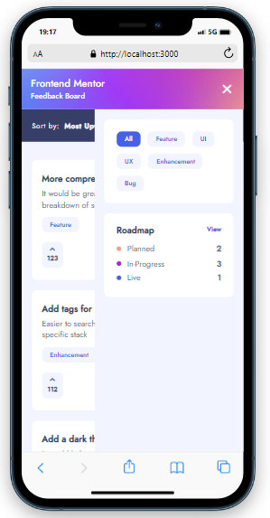
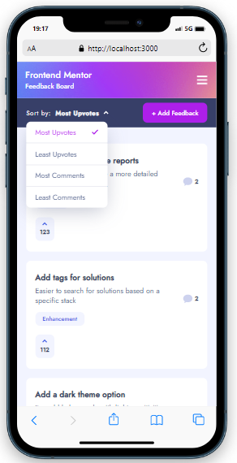
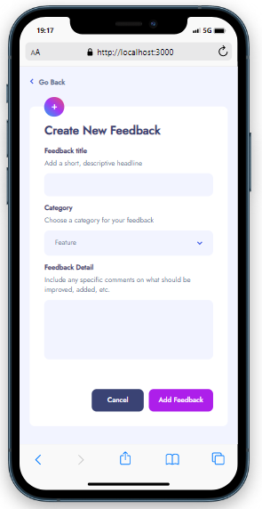
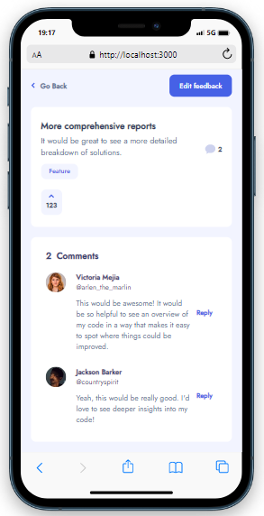

## Product Feedback Page

- O projeto consiste em uma página de avaliação e inclusão de sugestões sobre determinado produto digital. O projeto foi inspirado pelo desafio publicado no site [**Frontend Mentor**](https://www.frontendmentor.io/).

## Sumário

- [Tecnologias utilizadas](#tecnologias)
- [Instruções para rodar o projeto](#instrucoes)
- [Organização e estruturação do projeto](#organizacao)
- [Desenvolvimento](#desenvolvimento)
- [Imagens](#imagens)

## Tecnologias Utilizadas <a name="tecnologias"></a>

- [**React**](https://pt-br.reactjs.org/)
- [**React Hooks**](https://pt-br.reactjs.org/docs/hooks-intro.html)
- [**Styled Components**](https://styled-components.com/)
- [**Redux Toolkit**](https://redux-toolkit.js.org/)
- [**React Redux**](https://react-redux.js.org/)
- [**React Router Dom**](https://v5.reactrouter.com/web/guides/quick-start)


## Instruções para rodar o projeto <a name="instrucoes"></a>

### Será necessário ter instalado na sua máquina:

```
Git
React
Vite
```

- Clone o repositório com o comando **git clone**:

```
git clone https://github.com/felipehimself/product-feedback
```

- Entre no diretório que acabou de ser criado:

```
cd product-feedback
```

- Para o projeto funcionar na sua máquina, será necessário instalar suas dependências, para isso, utilize o comando:

```
npm install
```

- Pronto, agora o projeto está pronto para ser rodado localmente, utilizando o comando **npm run dev**:

```
npm run dev
```

## Organização e estruturação do projeto <a name="organizacao"></a>

O projeto está organizado e estruturado da seguinte forma:

```
│   App.tsx
│   favicon.svg
│   logo.svg
│   main.tsx
│   vite-env.d.ts
│
├───assets
│   └───images
│           background.png
│           currentuser.jpg
│           image-anne.jpg
│           image-elijah.jpg
│           image-george.jpg
│           image-jackson.jpg
│           image-james.jpg
│           image-javier.jpg
│           image-roxanne.jpg
│           image-ryan.jpg
│           image-suzanne.jpg
│           image-thomas.jpg
│           image-victoria.jpg
│
├───components
│   ├───CardSuggestion
│   │   ├───Card
│   │   │       Card.tsx
│   │   │       styles.ts
│   │   │
│   │   └───Container
│   │           Container.tsx
│   │           style.ts
│   │
│   ├───DropDown
│   │       DropDown.tsx
│   │       style.ts
│   │
│   ├───GoBack
│   │       Goback.tsx
│   │       styles.ts
│   │
│   ├───Nav
│   │       Navbar.tsx
│   │       styles.ts
│   │
│   ├───NoFeedBack
│   │       NoFeedBack.tsx
│   │       styles.ts
│   │
│   ├───shared
│   │       shared.ts
│   │
│   ├───Svgs
│   │       ArrowLeftIcon.tsx
│   │       ArrowUpIcon.tsx
│   │       CheckIcon.tsx
│   │       CloseIcon.tsx
│   │       CommentIcon.tsx
│   │       DropDownIcon.tsx
│   │       HamburguerIcon.tsx
│   │       LampIcon.tsx
│   │       NoFeedbackIcon.tsx
│   │       PencilIcon.tsx
│   │
│   ├───Topbar
│   │       styles.ts
│   │       Topbar.tsx
│   │
│   └───Upvote
│           style.ts
│           Upvote.tsx
│
├───constants
│       styles.ts
│
├───global
│       GlobalStyles.ts
│
├───interfaces
│       DataInterface.ts
│
├───pages
│   ├───AddFeedback
│   │       FormAdd.tsx
│   │       styles.ts
│   │
│   ├───Details
│   │       Details.tsx
│   │       styles.ts
│   │
│   ├───EditFeedback
│   │       FormEdit.tsx
│   │       styles.ts
│   │
│   ├───Home
│   │       Home.tsx
│   │
│   └───Roadmap
│           Roadmap.tsx
│           styles.ts
│
├───store
│   │   store.ts
│   │
│   └───slices
│           dataSlice.ts
│           filterListSlice.ts
│
└───utils
        data.ts
        functions.ts
```

## Desenvolvimento <a name="desenvolvimento" ></a>

### Estilização

Para realizar a estilização, foi utilizado:

- [**Styled Components**](https://styled-components.com/).

### Esquema de rotas

Para a implementação de rotas foi utilizado:

- [**React Router Dom**](https://v5.reactrouter.com/web/guides/quick-start)

### Gerenciamento de Estados

Para o gerenciamento de estados foram utilizados:

- [**Redux Toolkit**](https://redux-toolkit.js.org/)
- [**React Redux**](https://react-redux.js.org/)


## Imagens <a name="imagens" ></a>

### Desktop

 
 
 
 
 


### Mobile

 
 
 
 
 
